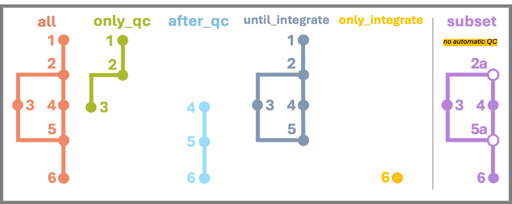
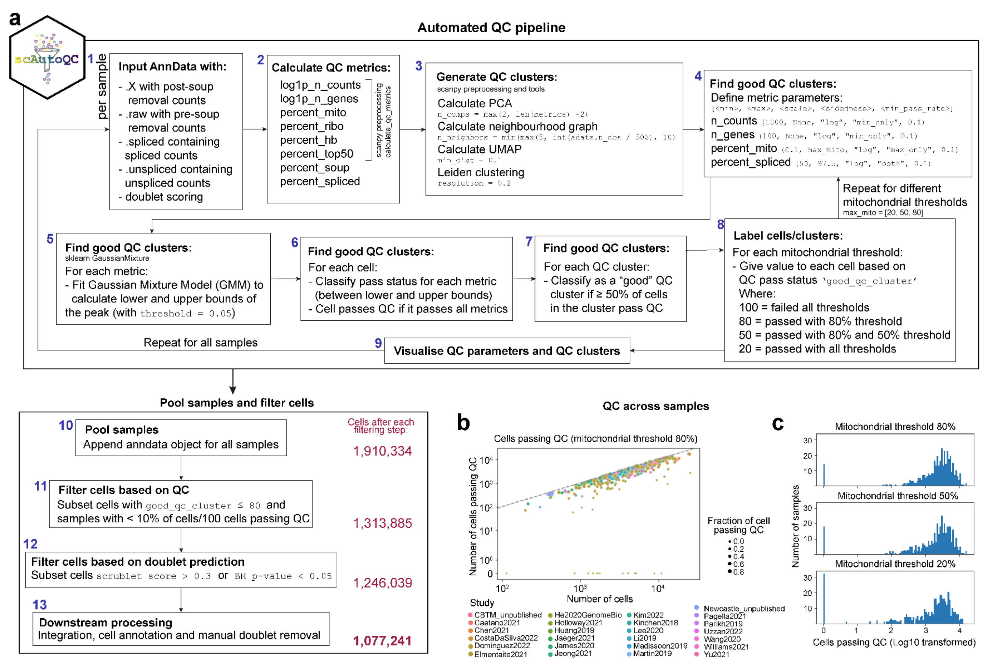

# nf-scautoqc

nf-scautoqc is the Nextflow implementation of [scAutoQC pipeline](https://teichlab.github.io/sctk/notebooks/automatic_qc.html) used in [Oliver et al, 2024](https://doi.org/10.1038/s41586-024-07571-1). 

## How to run:

The recommended way to use nextflow is to run it in a screen session. These steps can be directly used in Sanger's FARM, but you can modify each step according to the environment you're working on or the job scheduler your HPC uses:

1. Start a screen session: `screen -S nf_run1`
2. Start a small interactive job for nextflow: `bsub -G cellgeni -n1 -R"span[hosts=1]" -Is -q long -R"select[mem>2000] rusage[mem=2000]" -M2000 bash`
3. Modify one of RESUME scripts in examples folder (pre-made Nextflow run scripts)
4. Run the RESUME scripts you modified: `./RESUME-scautoqc-all`
5. You can leave your screen session and let it run in the background: `Ctrl+A, D`

## Files:

* `main.nf` - the Nextflow pipeline that executes scAutoQC pipeline.
* `nextflow.config` - the configuration script that allows the processes to be submitted to IBM LSF on Sanger's HPC and ensures correct environment is set via singularity container (this is an absolute path). Global default parameters are also set in this file and some contain absolute paths.
* `examples/` - a folder that includes pre-made Nextflow run scripts for each workflow:
  * `RESUME-scautoqc-all` 
  * `RESUME-scautoqc-onlyqc`
  * `RESUME-scautoqc-afterqc`
  * `RESUME-scautoqc-untilintegrate`
  * `RESUME-scautoqc-onlyintegrate`
  * `RESUME-scautoqc-subset` 
* `bin/` - a folder that includes Python scripts used in the pipeline:
  * `gather_matrices.py` - gathers matrices from STARsolo, Velocyto and Cellbender outputs (used in step 1).
  * `qc.py` - runs automatic QC workflow (used in step 2).
  * `subset.py` - subsets the input object (used in step 2a).
  * `flag_doublet.py` - runs scrublet to find doublets (used in step 3).
  * `pool_all.py` - combines all of the output objects after QC step (used in step 4).
  * `add_scrublet_meta.py` - adds scrublet scores (and metadata if available) (used in step 5).
  * `add_scrublet_meta_basic.py` - adds scrubles scores but doesn't remove any cells or samples (used in 5a).
  * `integration.py` - runs scVI integration (used in step 6).
* `genes_list/` - a folder that includes cell cycle, immunoglobulin and T cell receptor genes.
* `Dockerfile` - a dockerfile to reproduce the environment used to run the pipeline.

## Workflow


  

This pipeline implements the scAutoQC workflow, performing automated quality control, doublet detection, and optional integration for single-cell RNA-seq data. It processes samples individually through QC steps, pools them, adds metadata and doublet flags, and finally integrates the data using scVI. Different run modes allow flexibility in executing specific parts of the workflow.

### Inputs

The pipeline requires the following primary inputs, typically configured via command-line parameters or within a RESUME script:

*   A file listing the samples to be processed (`--SAMPLEFILE`).
*   Paths to the primary gene expression data, which can be:
    *   STARsolo output directories (`--ss_prefix`). The specific output type (e.g., `Gene`, `GeneFull`) is specified with `--ss_out`.
    *   Cell Ranger output directories (`--cr_prefix`). Should work fine with all workflows, but it's primarily used in `subset` mode or if STARsolo data is unavailable.
*   Path to CellBender HDF5 output files (`--cb_prefix`). If provided, used as the primary source for the main expression matrix and cell/gene metadata. Otherwise, STARsolo/Cell Ranger outputs are used.
*   A file containing cell-level metadata to be added after pooling (`--metadata`).
*   A CSV file specifying manual QC cutoffs when running in `subset` mode (`--limits_csv`). Example file was provided as `example_cutoffs.csv` (Subset Mode Only).

### Outputs

The pipeline generates several outputs, organized into a results directory (e.g., `scautoqc-results-<project_tag>`):

*   ***[output 1]:*** Individual H5AD objects per sample with raw, spliced, unspliced, and ambiguous layers (`1_gathered_objects/`).
*   ***[output 2]:*** Individual H5AD objects per sample after QC, containing QC metrics and filtering flags (`2_qc_objects/`). In `subset` mode, this contains QC metrics but no automatic filtering flags.
*   ***[output 3]:*** QC plots generated for each individual sample during the `run_qc` step (`2_qc_plots_individual/`). Not generated in `subset` mode.
*   ***[output 4]:*** CSV files containing predicted doublet scores from Scrublet for each sample (`3_doublet_scores/`).
*   ***[output 5]:*** A single, pooled H5AD object containing data from all samples after individual QC (`scautoqc_pooled.h5ad`).
*   ***[output 6]:*** The pooled H5AD object after adding metadata and doublet flags (`scautoqc_pooled_doubletflagged_metaadded.h5ad`). Samples failing basic QC checks might be removed (except in `subset` mode).
*   ***[output 7]:*** Overall QC plots generated after pooling and metadata addition (`5_qc_plots_overall/`). Structure differs slightly in `subset` mode.
*   ***[output 8]:*** A CSV file summarizing sample-level QC pass rates based on different mitochondrial thresholds (`sample_passqc_df.csv`). Not generated in `subset` mode.
*   ***[output 9]:*** The final, integrated H5AD object after running scVI (`scautoqc_integrated.h5ad`). Generated only if integration steps are run.
*   ***[output 10]:*** ELBO plot from the scVI model training (`5_qc_plots_overall/`). Generated only if integration steps are run.

### Run Modes

  
The default version of the pipeline runs all the steps shown the diagram above. This pipeline has six run modes as shown above:
* `all`: runs all steps (1-2-3-4-5-6)
* `only_qc`: runs the steps until pooling including doublet finding (1-2-3)
* `after_qc`: runs the steps starting from pooling (4-5-6)
* `until_integrate`: runs the steps until integration (1-2-3-4-5)
* `only_integrate`: runs the integration step only (6)
* `subset`: runs the pipeline differently than the other modes (2a-3-4-5a)  
  * `subset_object` step replaces the `run_qc` step. This mode doesn't run automatic QC; instead, it calculates QC metrics and subsets according to the cutoffs you provide in the `--limits_csv` parameter in the 2nd step (2a).
  * `add_metadata_basic` step replaces the `add_metadata` step. The only difference in this step is that it doesn't remove any cells or samples (5a).

The parameters needed for all run modes are already specified in different RESUME scripts in `examples` folder, and also can be found below:

<details>

<summary>Workflow: all</summary>

```
# to run all the steps
nextflow run cellgeni/nf-scautoqc -r main \
  -entry all \            # to choose run mode
  --SAMPLEFILE /path/to/sample/file \
  --metadata /path/to/metadata/file \
  --ss_prefix /path/to/starsolo-results \
  --cb_prefix /path/to/cellbender-results \
  --ss_out Gene \         # to specify which STARsolo output folder to use (Gene or GeneFull)
  --project_tag test1 \   # to specify the run to add to the end of output folder (e.g. scautoqc-results-test1)
  --batch_key sampleID \  # batch key to use in scVI integration
  --ansi-log false \
  -resume
```
</details>


<details>

<summary>Workflow: only_qc</summary>

```
# to run all the steps before pooling
nextflow run cellgeni/nf-scautoqc -r main \
  -entry only_qc \            # to choose run mode
  --SAMPLEFILE /path/to/sample/file \
  --metadata /path/to/metadata/file \
  --ss_prefix /path/to/starsolo-results \
  --cb_prefix /path/to/cellbender-results \
  --ss_out Gene \         # to specify which STARsolo output folder to use (Gene or GeneFull)
  --project_tag test1 \   # to specify the run to add to the end of output folder (e.g. scautoqc-results-test1)
  --batch_key sampleID \  # batch key to use in scVI integration
  --ansi-log false \
  -resume
```

</details>


<details>

<summary>Workflow: after_qc</summary>

```
# to run after qc steps 
nextflow run cellgeni/nf-scautoqc -r main \
  -entry after_qc \            # to choose run mode
  --SAMPLEFILE /path/to/sample/file \
  --postqc_path /path/to/postqc/objects \
  --scrublet_path /path/to/scrublet/csvs \
  --metadata /path/to/metadata/file \
  --project_tag test1 \   # to specify the run to add to the end of output folder (e.g. scautoqc-results-test1)
  --batch_key sampleID \  # batch key to use in scVI integration
  --ansi-log false \
  -resume
```

</details>


<details>

<summary>Workflow: until_integrate</summary>

```
# to run steps until integration
nextflow run cellgeni/nf-scautoqc -r main \
  -entry until_integrate \            # to choose run mode
  --SAMPLEFILE /path/to/sample/file \
  --metadata /path/to/metadata/file \
  --ss_prefix /path/to/starsolo-results \
  --cb_prefix /path/to/cellbender-results \
  --project_tag test1 \   # to specify the run to add to the end of output folder (e.g. scautoqc-results-test1)
  --ansi-log false \
  -resume
```

</details>


<details>

<summary>Workflow: only_integrate</summary>

```
# to run the integration step only
nextflow run cellgeni/nf-scautoqc -r main \
  -entry only_integrate \            # to choose run mode
  --path_for_scvi /path/to/object/to/integrate \
  --project_tag test1 \   # to specify the run to add to the end of output folder (e.g. scautoqc-results-test1)
  --batch_key sampleID \  # batch key to use in scVI integration
  --ansi-log false \
  -resume
```

</details>


<details>

<summary>Workflow: subset</summary>

```
# to run all the steps without automatic qc
nextflow run cellgeni/nf-scautoqc -r main \
  -entry subset \                             # to choose run mode
  --SAMPLEFILE /path/to/sample/file \
  --metadata /path/to/metadata/file \
  --cr_prefix /path/to/cellranger/folder \    # to specify the cellranger output path
  --limits_csv /path/to/limits/file \         # to specify the cutoffs used for subsetting
  --project_tag project1 \         # to specify the run to add to the end of output folder (e.g. scautoqc-results-test1)
  --ansi-log false \
  -resume
```

</details>


### 1. `gather_matrices`  

The inputs for the first step are determined according to STARsolo output which is specificed to use `ss_out`:
* By default, "Gene" folder is used (assuming the data is single-cell).
* "GeneFull" folder is used if the data is single-nuc.

This step requires three inputs:
  * STARsolo output folder named "Gene" (or "GeneFull")
  * STARsolo output folder named "Velocyto" (ignored if "GeneFull")
  * Cellbender output in h5 format (if not provided, STARsolo outputs will be used only) (option to change mode will be added in the future)  

`gather_matrices` step combines the matrices from three inputs into one h5ad object with multiple layers for each sample: raw, spliced, unspliced, ambiguous (only raw layer is used if "GeneFull" mode is specified). Main expression matrix, cell and gene metadata are retrieved from Cellbender output. Raw matrix is retrieved from the expression matrix of STARsolo output folder named Gene. Spliced, unspliced and ambiguous matrices are all retrieved from the expression matrices of STARsolo output folder named Velocyto.

This step can also use Cell Ranger inputs if `cr_prefix` option is provided instead of `ss_prefix` option, however this won't include Velocyto outputs.

This step produces:  
* ***[output 1]:*** h5ad object with different layers

### 2. `run_qc`

This step requires the output of `gather_matrices` step which is the h5ad object with one or more layers.  

`run_qc` step uses main automatic QC workflow which is summarised [here](https://teichlab.github.io/sctk/notebooks/automatic_qc.html). It applies the QC based on 8 QC metrics (log1p_n_counts, log1p_n_genes, percent_mito, percent_ribo, percent_hb, percent_top50, percent_soup, percent_spliced - last one is ignored if "GeneFull" mode is specified), and run CellTypist based on four models which are specified below and defined as default in this pipeline (Due to the nature of this study, only gut-related models were used):  
*  **cecilia22_predH:** CellTypist model from the immune populations combined from 20 tissues of 18 studies, includes 32 cell types (ref: [Domínguez-Conde et al, 2022](https://doi.org/10.1126/science.abl5197))
*  **cecilia22_predL:** CellTypist model from the immune sub-populations combined from 20 tissues of 18 studies, includes 98 cell types (ref: [Domínguez-Conde et al, 2022](https://doi.org/10.1126/science.abl5197))
*  **elmentaite21_pred:** CellTypist model from the intestinal cells from fetal, pediatric (healthy and Crohn's disease) and adult human gut, includes 134 cell types (ref: [Elmentaite et al, 2021](https://doi.org/10.1038/s41586-021-03852-1))
*  **suo22_pred:** CellTypist model from the stromal and immune populations from the human fetus, includes 138 cell types (ref: [Suo et al, 2022](https://doi.org/10.1126/science.abo0510))
*  **megagut_pred:** CellTypist model from the all cells in Pan-GI study, includes 89 cell types (ref: [Oliver et al, 2024](https://doi.org/10.1038/s41586-024-07571-1)).

This step produces [output 2] and [output 3]: 
* ***[output 2]:*** an h5ad object with QC metrics, "good_qc_cluster" and "pass_auto_filter" columns tested with different mitochondrial thresholds,  
* ***[output 3]:*** QC plots for each sample:  
  * UMAP plots:
    * coloured by each metric and good_qc_cluster and qc_cluster
    * coloured by probability scores, uncertain and predicted labels using the first model (cecilia22_predH)
    * coloured by good_qc_cluster, pass_auto_filter, pass_default and qc_cluster
  * violin plot for each metric grouped by QC clusters  
  * scatter plots for n_counts vs each metric:
    * coloured by good_qc_cluster
    * coloured by pass_default_filter
    * coloured by pass_auto_filter
    * coloured by the probability of a CellTypist prediction using the first model (cecilia22_predH)

### 3. `find_doublets`  

This step requires the output of `run_qc` step which is the h5ad object with postqc columns.  

`find_doublets` step runs [scrublet](https://github.com/swolock/scrublet) on the h5ad object and annotates the doublet scores to cells. This step runs in parallel with step 4 for efficiency.

This step produces:  
* ***[output 4]:*** CSV file with scrublet scores for each cell barcode for each sample.

### 4. `pool_all`  

This step requires the outputs of `run_qc` step from all the samples.  

`pool_all` step combines all of the objects produced in `run_qc` step in a single h5ad object.

This step produces:
* ***[output 5]:*** a concatenated h5ad object with all the samples

### 5. `add_metadata`  

This step requires the h5ad output from `pool_all` and the scrublet csv outputs from `find_doublets` steps.  

`add_metadata` step gives scores of different QC metrics of each sample, and adds scrublet scores (and the cell metadata according to samples if provided) to the h5ad object. This step also removes the samples with bad QC scores (passQC_frac80 lower than 0.1 and passQC_count80 lower than 100).

This step produces [output 6], [output 7], [output 8]:
* ***[output 6]:*** pooled h5ad object with metadata
* ***[output 7]:*** QC plots: 
  * scatter plot of total_cell_count vs passQC_count80 coloured by each sample
  * histogram of log of samples that have passQC_count20, passQC_count50 and passQC_count80 columns True
* ***[output 8]:*** CSV with percentages of the cells passed QC for each test

### 6. `integrate`  

This step requires the h5ad object from `add_metadata` step.
`integrate` step removes stringent doublets applies scVI integration to all samples by using "sampleID" as a batch key (by default), and "log1p_n_counts" and "percent_mito" columns as categorical covariates. The final integrated object is given as the output of all of this pipeline. The steps below are applied before running integration:  
* Stringent doublets (cells with doublet score higher than 0.3, and bh score lower than 0.05) are removed.  
* 7500 highly variable genes are chosen.  
* All cell cycle genes are removed.  
* The dimensionality of the latent space is chosen as 20.
* The batch size is chosen as 256.

This step produces:
* ***[output 9]:*** final integrated h5ad object
* ***[output 10]:*** ELBO plot from scVI training

## Different steps for `subset` mode

### 2a. `subset_object` (`subset` mode only)

This step requires the Cell Ranger outputs specified by the `--cr_prefix` parameter and a CSV file containing the subsetting cutoffs provided via the `--limits_csv` parameter.

The `subset_object` step is exclusive to the `subset` mode and replaces the `run_qc` step from the main pipeline. Unlike the main pipeline, it does not execute the automatic QC algorithm, which is a core component of the scAutoQC pipeline. Instead, it calculates QC metrics and subsets the data based on the cutoffs defined in the `--limits_csv` parameter.

This step produces:
* ***[output 2]:*** an h5ad object with QC metrics.

### 5a. `add_metadata_basic` (`subset` mode only)

This step requires the h5ad output from the `pool_all` step and the scrublet CSV outputs from the `find_doublets` step.

The `add_metadata_basic` step is also exclusive to the `subset` mode and replaces the `add_metadata` step from the main pipeline. The key differences are that it does not perform QC scoring per sample and does not remove any cells or samples.

## Original workflow scheme



# Changelog

For a version history/changelog, please see the [CHANGELOG file](CHANGELOG.md).