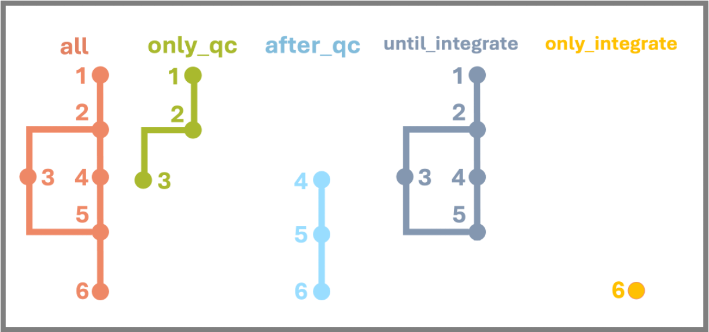

# nf-scautoqc

nf-scautoqc is the Nextflow implementation of [scAutoQC pipeline](https://teichlab.github.io/sctk/notebooks/automatic_qc.html) used in Oliver et al, 2024. 

## Contents:

## Files:
* `main.nf` - the Nextflow pipeline that executes scAutoQC pipeline.
* `nextflow.config` - the configuration script that allows the processes to be submitted to IBM LSF on Sanger's HPC and ensures correct environment is set via singularity container (this is an absolute path). Global default parameters are also set in this file and some contain absolute paths.
* `RESUME-scautoqc-all` - an example run script that executes the whole pipeline.
* `RESUME-scautoqc-afterqc` - an example run script that executes the pipeline after run_qc and find_doublets steps.
* `RESUME-scautoqc-onlyqc` - an example run script that executes the pipeline after until pooling step.
* `bin/gather_matrices.py` - a Python script that gathers matrices from STARsolo, Velocyto and Cellbender outputs (used in step 1).
* `bin/qc.py` - a Python script that runs automatic QC workflow (used in step 2).
* `bin/flag_doublet.py` - a Python script that runs scrublet to find doublets (used in step 3).
* `bin/pool_all.py` - a Python script that combines all of the output objects after QC step (used in step 4).
* `bin/add_scrublet_meta.py` - a Python script that adds scrublet scores (and metadata if available) (used in step 5).
* `bin/integration.py` - a Python script that runs scVI integration (used in step 6).
* `genes_list/` - a folder that includes cell cycle, immunoglobulin and T cell receptor genes.
* `Dockerfile` - a dockerfile to reproduce the environment used to run the pipeline.

## Workflow

  
This pipeline produces 10 outputs, each were detailed in their corresponding steps:
* ***[output 1]:*** h5ad object with different layers
* ***[output 2]:*** h5ad object with QC metrics
* ***[output 3]:*** QC plots for each sample
* ***[output 4]:*** CSV file with scrublet scores
* ***[output 5]:*** pooled h5ad object with all the samples
* ***[output 6]:*** pooled h5ad object with metadata
* ***[output 7]:*** QC plots
* ***[output 8]:*** CSV with QC metrics for each sample
* ***[output 9]:*** final integrated h5ad object
* ***[output 10]:*** ELBO plot from scVI training



<!--    -->
The default version of the pipeline runs all the steps shown the diagram above. This pipeline has three run modes as shown on the right:
* `all`: runs all steps (1-2-3-4-5-6)
* `only_qc`: runs the steps until pooling including doublet finding (1-2-3)
* `after_qc`: runs the steps starting from pooling (4-5-6)


The parameters needed for all run modes are already specified in different RESUME scripts, and also can be found below:

<details>

<summary>Workflow: all</summary>


```
# to run all the steps
nextflow run main.nf \
  -entry all \            # to choose run mode
  --SAMPLEFILE /path/to/sample/file \
  --metadata /path/to/metadata/file \
  --ss_prefix /path/to/starsolo-results \
  --cb_prefix /path/to/cellbender-results \
  --ss_out Gene \         # to specify which STARsolo output folder to use (Gene or GeneFull)
  --project_tag test1 \   # to specify the run to add to the end of output folder (e.g. scautoqc-results-test1)
  --batch_key sampleID \  # batch key to use in scVI integration
  --ansi-log false \
  -resume
```
</details>


<details>

<summary>Workflow: only_qc</summary>

```
# to run all the steps before pooling
nextflow run main.nf \
  -entry only_qc \            # to choose run mode
  --SAMPLEFILE /path/to/sample/file \
  --metadata /path/to/metadata/file \
  --ss_prefix /path/to/starsolo-results \
  --cb_prefix /path/to/cellbender-results \
  --ss_out Gene \         # to specify which STARsolo output folder to use (Gene or GeneFull)
  --project_tag test1 \   # to specify the run to add to the end of output folder (e.g. scautoqc-results-test1)
  --batch_key sampleID \  # batch key to use in scVI integration
  --ansi-log false \
  -resume
```

</details>


<details>

<summary>Workflow: after_qc</summary>

```
# to run after qc steps 
nextflow run main.nf \
  -entry after_qc \            # to choose run mode
  --SAMPLEFILE /path/to/sample/file \
  --postqc_path /path/to/postqc/objects \
  --scrublet_path /path/to/scrublet/csvs \
  --metadata /path/to/metadata/file \
  --project_tag test1 \   # to specify the run to add to the end of output folder (e.g. scautoqc-results-test1)
  --batch_key sampleID \  # batch key to use in scVI integration
  --ansi-log false \
  -resume
```

</details>


### 1. `gather_matrices`  

The inputs for the first step are determined according to STARsolo output which is specificed to use `ss_out`:
* By default, "Gene" folder is used (assuming the data is single-cell).
* "GeneFull" folder is used if the data is single-nuc.

This step requires three inputs:
  * STARsolo output folder named "Gene" (or "GeneFull")
  * STARsolo output folder named "Velocyto" (ignored if "GeneFull")
  * Cellbender output in h5 format (if not provided, STARsolo outputs will be used only) (option to change mode will be added in the future)  

`gather_matrices` step combines the matrices from three inputs into one h5ad object with multiple layers for each sample: raw, spliced, unspliced, ambiguous (only raw layer is used if "GeneFull" mode is specified). Main expression matrix, cell and gene metadata are retrieved from Cellbender output. Raw matrix is retrieved from the expression matrix of STARsolo output folder named Gene. Spliced, unspliced and ambiguous matrices are all retrieved from the expression matrices of STARsolo output folder named Velocyto.

This step produces:  
* ***[output 1]:*** h5ad object with different layers

### 2. `run_qc`

This step requires the output of `gather_matrices` step which is the h5ad object with one or more layers.  

`run_qc` step uses main automatic QC workflow which is summarised [here](https://teichlab.github.io/sctk/notebooks/automatic_qc.html). It applies the QC based on 8 QC metrics (log1p_n_counts, log1p_n_genes, percent_mito, percent_ribo, percent_hb, percent_top50, percent_soup, percent_spliced - last one is ignored if "GeneFull" mode is specified), and run CellTypist based on four models which are specified below and defined as default in this pipeline (Due to the nature of this study, only gut-related models were used):  
*  **cecilia22_predH:** CellTypist model from the immune populations combined from 20 tissues of 18 studies, includes 32 cell types (ref: [Domínguez-Conde et al, 2022](https://doi.org/10.1126/science.abl5197))
*  **cecilia22_predL:** CellTypist model from the immune sub-populations combined from 20 tissues of 18 studies, includes 98 cell types (ref: [Domínguez-Conde et al, 2022](https://doi.org/10.1126/science.abl5197))
*  **elmentaite21_pred:** CellTypist model from the intestinal cells from fetal, pediatric (healthy and Crohn's disease) and adult human gut, includes 134 cell types (ref: [Elmentaite et al, 2021](https://doi.org/10.1038/s41586-021-03852-1))
*  **suo22_pred:** CellTypist model from the stromal and immune populations from the human fetus, includes 138 cell types (ref: [Suo et al, 2022](https://doi.org/10.1126/science.abo0510))
*  **megagut_pred:** CellTypist model from the all cells in Pan-GI study, includes 89 cell types (ref: [Oliver et al, 2024 (in press)]).

This step produces [output 2] and [output 3]: 
* ***[output 2]:*** an h5ad object with QC metrics, "good_qc_cluster" and "pass_auto_filter" columns tested with different mitochondrial thresholds,  
* ***[output 3]:*** QC plots for each sample:  
  * UMAP plots:
    * coloured by each metric and good_qc_cluster and qc_cluster
    * coloured by probability scores, uncertain and predicted labels using the first model (cecilia22_predH)
    * coloured by good_qc_cluster, pass_auto_filter, pass_default and qc_cluster
  * violin plot for each metric grouped by QC clusters  
  * scatter plots for n_counts vs each metric:
    * coloured by good_qc_cluster
    * coloured by pass_default_filter
    * coloured by pass_auto_filter
    * coloured by the probability of a CellTypist prediction using the first model (cecilia22_predH)

### 3. `find_doublets`  

This step requires the output of `run_qc` step which is the h5ad object with postqc columns.  

`find_doublets` step runs [scrublet](https://github.com/swolock/scrublet) on the h5ad object and annotates the doublet scores to cells. This step runs in parallel with step 4 for efficiency.

This step produces:  
* ***[output 4]:*** CSV file with scrublet scores for each cell barcode for each sample.

### 4. `pool_all`  

This step requires the outputs of `run_qc` step from all the samples.  

`pool_all` step combines all of the objects produced in `run_qc` step in a single h5ad object.

This step produces:
* ***[output 5]:*** a concatenated h5ad object with all the samples

### 5. `add_metadata`  

This step requires the h5ad output from `pool_all` and the scrublet csv outputs from `find_doublets` steps.  

`add_metadata` step gives scores of different QC metrics of each sample, and adds scrublet scores (and the cell metadata according to samples if provided) to the h5ad object. This step also removes the samples with bad QC scores (passQC_frac80 lower than 0.1 and passQC_count80 lower than 100).

This step produces [output 6], [output 7], [output 8]:
* ***[output 6]:*** pooled h5ad object with metadata
* ***[output 7]:*** QC plots: 
  * scatter plot of total_cell_count vs passQC_count80 coloured by each sample
  * histogram of log of samples that have passQC_count20, passQC_count50 and passQC_count80 columns True
* ***[output 8]:*** CSV with percentages of the cells passed QC for each test

### 6. `integrate`  

This step requires the h5ad object from `add_metadata` step.
`integrate` step removes stringent doublets applies scVI integration to all samples by using "sampleID" as a batch key (by default), and "log1p_n_counts" and "percent_mito" columns as categorical covariates. The final integrated object is given as the output of all of this pipeline. The steps below are applied before running integration:  
* Stringent doublets (cells with doublet score higher than 0.3, and bh score lower than 0.05) are removed.  
* 7500 highly variable genes are chosen.  
* All cell cycle genes are removed.  
* The dimensionality of the latent space is chosen as 20.
* The batch size is chosen as 256.

This step produces:
* ***[output 9]:*** final integrated h5ad object
* ***[output 10]:*** ELBO plot from scVI training

## Future plans

### Add run_cellbender process

* Current version of pipeline assumes that the Cellbender outputs exist. 
* This addition will allow the pipeline to run Cellbender if the inputs do not exist.

### Expand input options

* Current version of pipeline is able to take STARsolo outputs only.
* This expansion will allow user to specify the input type whether it is Cell Ranger or STARsolo input.
* For Cell Ranger inputs, the pipeline will be able to run Velocyto and Cellbender without specifying anything additionally.

### Smart memory allocation

* This addition will estimate the average memory needed for pool_all step, so it won't need to try multiple times until it runs well.


## Original workflow scheme


## Changelog

### v0.5.0
* <ins>**New workflow:**</ins> `only_qc`
  * It is now easier to run the pipeline until the pooling step. 
  * This can be used to process different sets of samples in different times, then all the outputs from this workflow  can be used together with `after_qc` mode.
* Improvements and changes in scripts:
  * It is now possible to run the pipeline without Cellbender output, STARsolo output is used only in this case.
  * Removing metadata columns in integration.py was reverted back
  * New RESUME scripts have been added
  * `after_qc` workflow can now use the samples in the sample list only rather than all the objects in the folder.
  * Reports folder is now named similar to the results folder.
  * Outputting plots in `run_qc` step now works as expected.
* Updates in README
  * The workflow diagram has been recreated.
  * The workflow modes have been described with a new figure.
  * Outputs from each step have been described in detail.
  * Text in some steps were revised.

### v0.4.0
* Added support for single-nuc samples
* Improvements in scripts
  * integration.py now removes the columns which were created in previous steps
  * RESUME scripts have been reorganised

### v0.3.0
* <ins>**New workflow:**</ins> `after_qc`
  * It is now easier to work with the samples which has been processed with scAutoQC pipeline before. 
* Improvements in nextflow pipeline and python scripts
  * Created new RESUME script for afterqc workflow.
  * integration.py should now work more efficiently.
  * ss_matrix and covar_keys parameters have been removed (they will be considered for the future releases). 

### v0.2.2
* Bug fixes

### v0.2.1
* Typo fix

### v0.2.0
* Improvements in python scripts
  * Changed output filenames in all scripts
  * gather_matrices.py
    - added support for Cellbender v3 outputs
  * qc.py
    - moved sampleID annotation step from pool_all.py
  * pool_all.py
    - added support for resume functionality of nextflow
    - removed sampleID annotation step (moved to qc.py)
  * add_scrublet_meta.py
    - added an extra step to remove empty columns in input metadata
  * integration.py
    - added support to specify batch key and categorical covariate keys (default: sampleID for batch key, empty for covariates)
* Improvements in main.py
  * fixed output generation problem
  * modified find_doublets process so it only runs for good QC samples
  * added batch_key parameter to specify the column from cell metadata for scVI integration (default: sampleID)
  * added covar_keys parameter to specify the columns from cell metadata for scVI integration (no default)
* Updated workflow figure in README.md

### v0.1.0
* First release