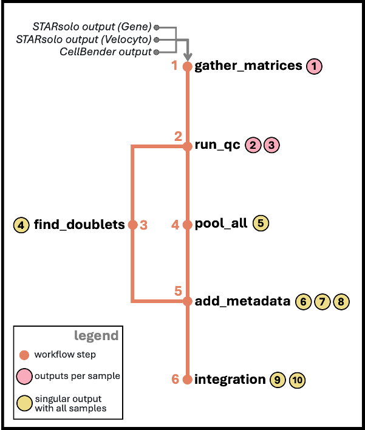
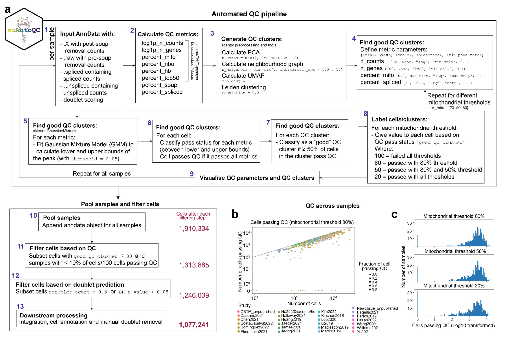

# nf-scautoqc

nf-scautoqc is the Nextflow implementation of [scAutoQC pipeline](https://teichlab.github.io/sctk/notebooks/automatic_qc.html) used in Oliver et al, 2024. 

## Contents:

## Files:
* `main.nf` - the Nextflow pipeline that executes scAutoQC pipeline.
* `nextflow.config` - the configuration script that allows the processes to be submitted to IBM LSF on Sanger's HPC and ensures correct environment is set via singularity container (this is an absolute path). Global default parameters are also set in this file and some contain absolute paths.
* `RESUME-scautoqc-all` - an example run script that executes the whole pipeline, it has four hardcoded argument: `/path/to/sample/file`, `/path/to/starsolo-results`, `/path/to/cellbender-results`, (optional: `/path/to/metadata/file`) that need to be changed based on your local set up.
* `RESUME-scautoqc-afterqc` - an example run script that executes the pipeline after run_qc and find_doublets steps, it has four hardcoded argument: `/path/to/sample/file`, `/path/to/postqc/objects`, `/path/to/scrublet/csvs`, (optional: `/path/to/metadata/file`) that need to be changed based on your local set up.
* `bin/gather_matrices.py` - a Python script that gathers matrices from STARsolo, Velocyto and Cellbender outputs.
* `bin/qc.py` - a Python script that runs automatic QC workflow.
* `bin/flag_doublet.py` - a Python script that runs scrublet to find doublets.
* `bin/pool_all.py` - a Python script that combines all of the output objects after QC step.
* `bin/add_scrublet_meta.py` - a Python script that adds scrublet scores (and metadata if available).
* `bin/integration.py` - a Python script that runs scVI integration.
* `genes_list/` - a folder that includes cell cycle, immunoglobulin and T cell receptor genes.
* `Dockerfile` - a dockerfile to reproduce the environment used to run the pipeline.

## Workflow

The default version of the pipeline runs all the steps shown the diagram below. This pipeline can use the steps after `run_qc` and `find_doublets` if the entry is used as `after_qc` and this requires different parameters. All parameters needed for both case are already specified in RESUME scripts, and also can be found below:

```
# to run all the steps
nextflow run main.nf \
  -entry all \            # to run all steps or steps after qc
  --SAMPLEFILE /path/to/sample/file \
  --metadata /path/to/metadata/file \
  --ss_prefix /path/to/starsolo-results \
  --cb_prefix /path/to/cellbender-results \
  --project_tag test1 \   # to specify the run to add to the end of output folder (e.g. scautoqc-results-test1)
  --batch_key sampleID \  # batch key to use in scVI integration
  --ansi-log false \
  -resume
```

```
# to run after qc steps 
nextflow run main.nf \
  -entry afterQC \
  --SAMPLEFILE /path/to/sample/file \
  --postqc_path /path/to/postqc/objects \
  --scrublet_path /path/to/scrublet/csvs \
  --metadata /path/to/metadata/file \
  --project_tag test1 \   # to specify the run to add to the end of output folder (e.g. scautoqc-results-test1)
  --batch_key sampleID \  # batch key to use in scVI integration
  --ansi-log false \
  -resume
```


output 1: h5ad object with four layers  
output 2: h5ad object with qc metrics  
output 3: QC plots  
output 4: CSV of scrublet scores  
output 5: pooled h5ad object  
output 6: pooled h5ad object with metadata  
output 7: QC plots  
output 8: CSV with percentages of the cells passed QC  
output 9: final h5ad object

### 1. `gather_matrices`  

This step requires three inputs: 
* STARsolo output folder named "Gene"
* STARsolo output folder named "Velocyto"
* Cellbender output in h5 format (if Cellbender output doesn't exist, change mode to cb+normal) (option to change mode will be added in the future)  

`gather_matrices` step combines the matrices from three inputs into one h5ad object with four layers (raw, spliced, unspliced, ambiguous). Main expression matrix, cell and gene metadata are retrieved from Cellbender output. Raw matrix is retrieved from the expression matrix of STARsolo output folder named Gene. Spliced, unspliced and ambiguous matrices are all retrieved from the expression matrices of STARsolo output folder named Velocyto.

### 2. `run_qc`

This step requires the output of `gather_matrices` step which is the h5ad object with four layers.  

`run_qc` step uses main automatic QC workflow which is summarised [here](https://teichlab.github.io/sctk/notebooks/automatic_qc.html). It applies the QC based on QC metrics, and run CellTypist based on four models which are specified below and defined as default in this pipeline:  
*  **cecilia22_predH:** CellTypist model from the immune populations combined from 20 tissues of 18 studies, includes 32 cell types (ref: [Domínguez-Conde et al, 2022](https://doi.org/10.1126/science.abl5197))
*  **cecilia22_predL:** CellTypist model from the immune sub-populations combined from 20 tissues of 18 studies, includes 98 cell types (ref: [Domínguez-Conde et al, 2022](https://doi.org/10.1126/science.abl5197))
*  **elmentaite21_pred:** CellTypist model from the intestinal cells from fetal, pediatric (healthy and Crohn's disease) and adult human gut, includes 134 cell types (ref: [Elmentaite et al, 2021](https://doi.org/10.1038/s41586-021-03852-1))
*  **suo22_pred:** CellTypist model from the stromal and immune populations from the human fetus, includes 138 cell types (ref: [Suo et al, 2022](https://doi.org/10.1126/science.abo0510))
*  **megagut_pred:** CellTypist model from the all cells in Pan-GI study, includes 89 cell types (ref: [Oliver et al, 2024 (in press)])


### 3. `find_doublets`  

This step requires the output of `run_qc` step which is the h5ad object with postqc columns.  

`find_doublets` step runs [scrublet](https://github.com/swolock/scrublet) on the h5ad object and annotates the doublet scores to cells. This step runs simultaneously with step 4 for efficiency.

### 4. `pool_all`  

This step requires the outputs of `run_qc` step from all the samples.  

`pool_all` step combines all of the objects produced in `run_qc` step in a single h5ad object.

### 5. `add_metadata`  

This step requires the h5ad output from `pool_all` and the scrublet csv outputs from `find_doublets` steps.  

`add_metadata` step gives scores of different QC metrics of each sample, and adds scrublet scores (and the cell metadata according to samples if provided) to the h5ad object. (QC-related plots are generated but are not copied to output directory, this will be fixed in the future.)  

### 6. `integrate`  

This step requires the h5ad object from `add_metadata` step.
`integrate` step removes stringent doublets (doublet score higher than 0.3, and bh score lower than 0.05) applies scVI integration to all samples by using "sampleID" as a batch key, and "log1p_n_counts" and "percent_mito" columns as categorical covariates. The final integrated object is given as the output of all of this pipeline. The steps below are applied before running integration:  
* Stringent doublets are removed.  
* 7500 higly variable genes are chosen.  
* All cell cycle genes are removed.  
* The dimensionality of the latent space is chosen as 20.
* The batch size is chosen as 256.

## Future plans

### Add support for multiome and single-nucleus samples

* nf-scautoqc currently uses "Gene" output folder from STARsolo.
* For the analysis of multiome and single-nucleus samples, GeneFull output folder from STARsolo is preferred. This matrix includes reads from introns.
* This pipeline currently doesn't support GeneFull matrices.
* In the future, the user will be able to specify STARsolo matrix (Gene or GeneFull).

### Add run_cellbender process

* Current version of pipeline assumes that the CellBender outputs exist. 
* This addition will allow the pipeline to run CellBender if the inputs do not exist.

### Expand input options

* Current version of pipeline is able to take STARsolo outputs only.
* This expansion will allow user to specify the input type whether it is Cellranger or STARsolo input.
* For Cellranger inputs, the pipeline will be able to run Velocyto and CellBender without specifying anything additionally.

### Smart memory allocation

* This addition will estimate the average memory needed for pool_all step, so it won't need to try multiple times until it runs well.


## Original workflow scheme



## Changelog

### v0.3.0
* New workflow: after_qc
  * It is now easier to work with the samples which has been processed with scAutoQC pipeline before. 
* Improvements in nextflow pipeline and python scripts
  * Created new RESUME script for afterqc workflow.
  * integration.py should now work more efficiently.
  * ss_matrix and covar_keys parameters have been removed (they will be considered for the future releases). 

### v0.2.2
* Bug fixes

### v0.2.1
* Typo fix

### v0.2.0
* Improvements in python scripts
  * Changed output filenames in all scripts
  * gather_matrices.py
    - added support for Cellbender v3 outputs
  * qc.py
    - moved sampleID annotation step from pool_all.py
  * pool_all.py
    - added support for resume functionality of nextflow
    - removed sampleID annotation step (moved to qc.py)
  * add_scrublet_meta.py
    - added an extra step to remove empty columns in input metadata
  * integration.py
    - added support to specify batch key and categorical covariate keys (default: sampleID for batch key, empty for covariates)
* Improvements in main.py
  * fixed output generation problem
  * modified find_doublets process so it only runs for good QC samples
  * added batch_key parameter to specify the column from cell metadata for scVI integration (default: sampleID)
  * added covar_keys parameter to specify the columns from cell metadata for scVI integration (no default)
* Updated workflow figure in README.md

### v0.1.0
* First release